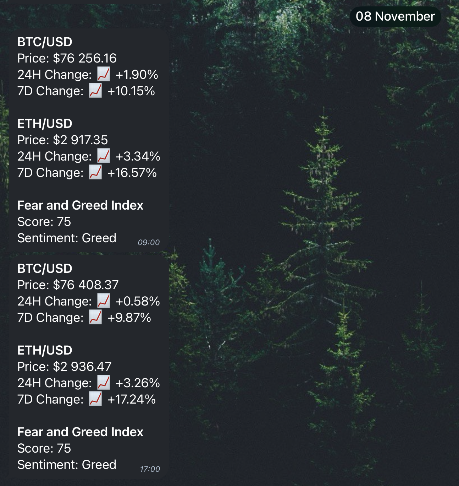

# Crypto Weather

## Project Overview

This project is a crypto-related Telegram bot that provides real-time market data, halving information, and notifications for BTC and ETH price updates.

## Features

### Price and Fear and Greed Updates

The bot allows Telegram users to receive real-time updates on BTC/ETH prices and the Fear and Greed index.

The update looks as follows:

Users can also subscribe to receive automatic updates twice a day.

To handle this, users that subscribed are stored in `subscriptions.json` and only their chat_id is stored. I'm doing this to ensure minimum data being stored and keep the privacy of users.

Finally, this feature is using simple API calls to different providers:

- Prices are taken from http://coinmarketcap.com.
- Greed and Fear index is taken from https://api.alternative.me/fng/

---

### ATH

The bot will also display a message when a new ATH is reached for BTC or ETH. This message will be sent only to people that subscribed for automatic updates.

This feature is using a websocket connection _(Binance websocket)_ to monitor the price at all times. The websocket is being rechecked every hour to avoid being disconnected.

In order to prevent spamming users, the module that handles the ATH alerts has a `time.sleep(10)` snippet to act as a buffer.

ATH are stored in `ath_values.json` file.

## Backend

The bot is running on a server.

You can either run it in site on a raspbery Pi or online. I'm using primarly Linode servers to run my bots.

The `run_update.sh` uses the `daily_updates.py`module and insures that my cron automation will run properly twice a day.

`main.py` and `new_ath.py` are run separately.

## Contact

Telegram: [@TechSherpa](https://t.me/TechSherpa)

GitHub: [@MaximeIn_Tech](https://github.com/MaximeIn-Tech)
